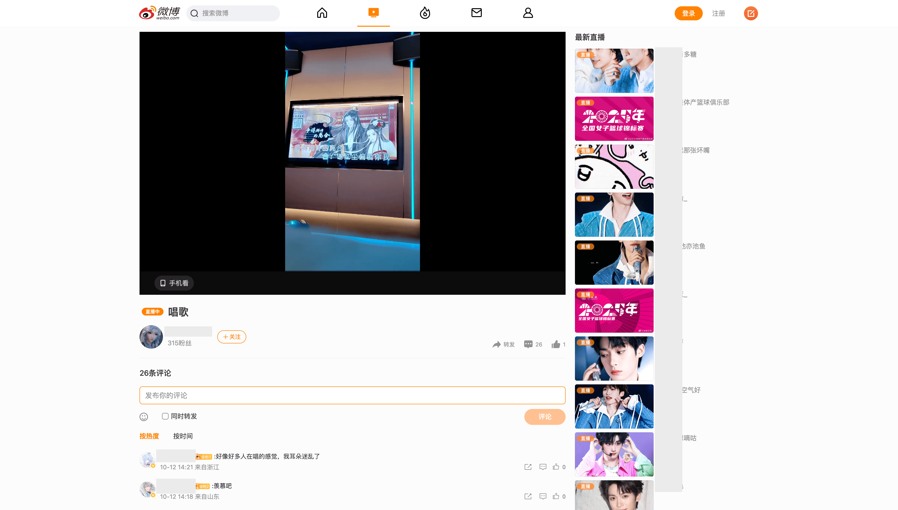
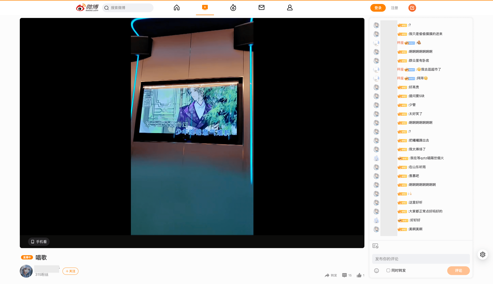

# 🧩 微博 PC 端弹幕助手

一个为 **微博直播 PC 端** 设计的弹幕助手脚本，提供弹幕展示、自动跳转新直播间、弹幕过滤与个性化设置等功能，让你的观播体验更加丝滑。

---

## 🌈 效果展示

> 以下截图展示了美化前后的界面对比与设置面板：

|                     原始界面                      |                     应用脚本后界面                     |
| :-----------------------------------------------: | :----------------------------------------------------: |
|  |  |

## 🚀 功能特性

- 💬 **实时显示弹幕**  
  清晰展示直播间的实时弹幕内容，支持自动更新与滚动。

- 🔍 **自动搜寻直播间**  
  自动检测并寻找当前主播新的直播状态。

- 🔄 **自动跳转新直播间**  
  主播下播后自动检测并跳转到其新的直播间，免去手动搜索的麻烦。

- 🧹 **弹幕过滤**  
  过滤无关内容，保持画面整洁。

- ⚙️ **个性化设置面板**  
  提供图形化设置界面，可自定义以下内容：
  - 弹幕刷新频率
  - 弹幕持续时间（滚动速度）
  - 弹幕上限
  - 自动搜索、自动跳转功能开关

- 💾 **配置自动保存**  
  所有设置均自动持久化，下次打开仍保持你的偏好。

---

## 🧠 主要设置说明

| 设置项             | 说明                                                                            |
| :----------------- | :------------------------------------------------------------------------------ |
| **自动搜寻直播间** | 自动检测关注主播是否开播。                                                      |
| **自动跳转直播间** | 发现主播新直播间时自动跳转。                                                    |
| **弹幕刷新间隔**   | 控制弹幕获取频率（单位：秒）。最小 3s，实际间隔会附加 0–3s 的随机延迟以防风控。 |
| **弹幕持续时间**   | 控制弹幕从屏幕右侧滚动到左侧的总时间（单位：秒）。数值越小速度越快。            |
| **弹幕上限**       | 控制屏幕上可同时显示的最大弹幕条数，超过后旧弹幕自动清除。                      |

## 📦 安装指南

1. **安装 Tampermonkey 浏览器扩展**
   - [Chrome 网上应用店](https://chrome.google.com/webstore/detail/tampermonkey/dhdgffkkebhmkfjojejmpbldmpobfkfo)
   - [Firefox 附加组件](https://addons.mozilla.org/zh-CN/firefox/addon/tampermonkey/)

2. **安装脚本**
   - 打开 [微博PC直播弹幕助手](https://greasyfork.org/zh-CN/scripts/551427-%E5%BE%AE%E5%8D%9Apc%E7%9B%B4%E6%92%AD%E5%BC%B9%E5%B9%95%E5%8A%A9%E6%89%8B?locale_override=1)
   - 点击「安装」即可。

3. **打开微博直播页面**
   - 打开任意微博直播间，即可看到弹幕助手面板和设置入口。

---

## ⚙️ 使用说明

- 点击⚙️设置图标打开「弹幕助手设置」面板；
- 修改配置后点击「保存配置」；
- 所有修改会自动生效并保存；
- 支持实时切换主播直播间，无需刷新页面。

---
