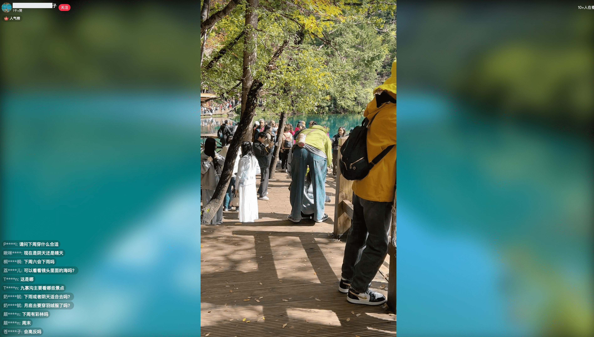

# 🌸 小红书 PC 端直播美化脚本

一个专为 **小红书直播网页端（PC 端）** 打造的用户脚本，提供更清爽的视觉体验、更顺畅的互动界面。  
让观看小红书直播变得更轻松、更美观。

---

## 🌈 效果展示

> 以下截图展示了美化前后的界面对比与设置面板：

|                    原始界面                     |                    应用脚本后界面                    |
| :---------------------------------------------: | :--------------------------------------------------: |
|  |  |

## ✨ 功能特性

- 💅 **直播界面美化**
  - 隐藏冗余 UI 元素（如底部小红书按钮等）
  - 优化弹幕显示区域
  - 调整布局，使画面更专注于主播与弹幕
  - 增加直播背景

- 🧩 **增强功能**
  - 自动播放

---

## 📦 安装指南

1. **安装油猴插件（Tampermonkey）**
   - [Chrome 网上应用店](https://chrome.google.com/webstore/detail/tampermonkey/dhdgffkkebhmkfjojejmpbldmpobfkfo)
   - [Firefox 附加组件](https://addons.mozilla.org/zh-CN/firefox/addon/tampermonkey/)

2. **安装脚本**
   - 打开 [小红书PC端直播美化脚本](https://greasyfork.org/zh-CN/scripts/551322-%E5%B0%8F%E7%BA%A2%E4%B9%A6pc%E7%AB%AF%E7%9B%B4%E6%92%AD%E7%BE%8E%E5%8C%96%E8%84%9A%E6%9C%AC?locale_override=1)
   - 点击「安装」即可。

3. **打开小红书直播页面**
   - 进入任意小红书直播间，即可看到优化后的直播界面。
